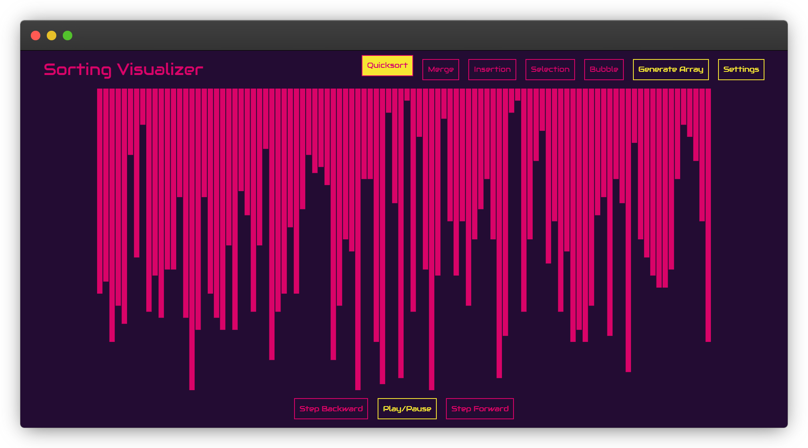

# Sorting visualizer

## Preview

[Visualizer can be previewed online here.](https://ushka1.github.io/sorting-visualizer/)

## Description

Sorting visualizer created with Typescript and HTML5 Canvas.

### Supported Sorting Algorithms

- Quick Sort
- Merge Sort
- Insertion Sort
- Selection Sort
- Bubble Sort

### Control Panel

- Adjust the size of the array
- Set the range of numbers in the array
- Control the sorting speed
- Choose a predefined array type:
  - Random Numbers
  - Almost Sorted Numbers
  - Few Unique Numbers
  - Reversed Order

## Setup

1. Run `npm install` to install the dependencies.
2. Run `npm run start` to start the development server.
